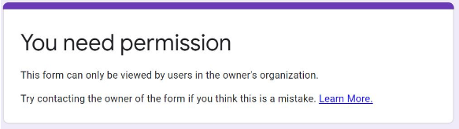

# FAQ - Pacman Projects - RMIT AI 2020

This is the FAQ only for the project assessments (i.e., pacman) projects. For general questions about the course, see the [Course FAQ](https://docs.google.com/document/d/17uVenkNdu5kKTzS8b_Pxkp5jAxNXrQCeDlxDf0yqwvQ/edit?pli=1).

As any FAQ page, this page is always "under construction". As we realize that some questions become common, we add them here.


Table of Contents
=================

   * [FAQ - Pacman Projects - RMIT AI 2020](#faq---pacman-projects---rmit-ai-2020)
   * [GENERAL](#general)
      * [In a code assignment/project, how do I make sure I do not go against academic integrity?](#in-a-code-assignmentproject-how-do-i-make-sure-i-do-not-go-against-academic-integrity)
      * [Cannot access the Google Form, says I need permission](#cannot-access-the-google-form-says-i-need-permission)
      * [How do I submit my project solution in my GIT repository?](#how-do-i-submit-my-project-solution-in-my-git-repository)
      * [How do I change the submission tag if I have already tagged one commit for submission?](#how-do-i-change-the-submission-tag-if-i-have-already-tagged-one-commit-for-submission)
      * [I submitted wrongly (e.g., didn't tag correctly) and is now after the due date, can you consider my submission?](#i-submitted-wrongly-eg-didnt-tag-correctly-and-is-now-after-the-due-date-can-you-consider-my-submission)
      * [How do I zip files in folder X without including the folder X itself?](#how-do-i-zip-files-in-folder-x-without-including-the-folder-x-itself)
   * [PACMAN SETUP](#pacman-setup)
      * [What is the best way to develop my solutions for the Pacman project?](#what-is-the-best-way-to-develop-my-solutions-for-the-pacman-project)
      * [What version of Python should I use?](#what-version-of-python-should-i-use)
      * [How do I run Python 3.6 in coreteaching?](#how-do-i-run-python-36-in-coreteaching)
      * [How to run Pacman remotely from coreteaching?](#how-to-run-pacman-remotely-from-coreteaching)
      * [Coreteaching? What is that?](#coreteaching-what-is-that)
      * [How do I setup a system in Windows with Python 3.6?](#how-do-i-setup-a-system-in-windows-with-python-36)
   * [TROUBLESHOOTING](#troubleshooting)
      * [Can I use problem._visited?](#can-i-use-problem_visited)
      * [I get "_tkinter.TclError: no display name and no $DISPLAY environment variable" error when running in WSL or ssh](#i-get-_tkintertclerror-no-display-name-and-no-display-environment-variable-error-when-running-in-wsl-or-ssh)
      * [Cannot run Pacman due to problems with Tkinter: "ImportError: No module named Tkinter"](#cannot-run-pacman-due-to-problems-with-tkinter-importerror-no-module-named-tkinter)
      * [How do I know the type of a variable in Python?](#how-do-i-know-the-type-of-a-variable-in-python)
      * [Error module 'cgi' has no attribute 'escape' when running autograder.pt](#error-module-cgi-has-no-attribute-escape-when-running-autograderpt)
   * [Project 1](#project-1)
      * [What actions should I return in the search algorithms?](#what-actions-should-i-return-in-the-search-algorithms)
      * [I am getting too many expansions. What counts as an expansion?](#i-am-getting-too-many-expansions-what-counts-as-an-expansion)
   * [Project 2](#project-2)
      * [Inconsistent depth in minimax project 2, Q2 and careful use of __init__](#inconsistent-depth-in-minimax-project-2-q2-and-careful-use-of-__init__)
   * [Capture the Flag](#capture-the-flag)
      * [How to load my additional files beyond myTeam.py?](#how-to-load-my-additional-files-beyond-myteampy)
      * [How can I use the FF planner (or any other binary) you provide?](#how-can-i-use-the-ff-planner-or-any-other-binary-you-provide)
      * [Do you provide library X (e.g., tensorflow)?](#do-you-provide-library-x-eg-tensorflow)
      * [Games go too fast! What should I do?](#games-go-too-fast-what-should-i-do)
      * [How do I replay a game?](#how-do-i-replay-a-game)
      * [How does one check if a given agent is currently scared? Is the only option to check the number of capsules in previous states?](#how-does-one-check-if-a-given-agent-is-currently-scared-is-the-only-option-to-check-the-number-of-capsules-in-previous-states)

Created by [gh-md-toc](https://github.com/ekalinin/github-markdown-toc)

-------------------------

# GENERAL

## In a code assignment/project, how do I make sure I do not go against academic integrity?

Check the [answer to this key question here](https://docs.google.com/document/d/1AQAU7cH9zgsneTAfig-afBoVfPCi6t1k2nBzFfhdBfc/edit?usp=sharing)

## Cannot access the Google Form, says I need permission

If you see something like this:



then chances are you are not correctly logged into your RMIT account or you are logged with your private Google account and your browser cannot distinguish. Either open it on an incognito browser window or make sure you are logged into your RMIT account. There is nothing I can do from my side if you don&rsquo;t access the form with the right authentication credentials.


## How do I submit my project solution in my GIT repository?

You submit by **tagging the _exact_ commit that you want to submit and be marked**, using the exact name given in the assignment specification. We will ONLY marked tagged submissions and will ONLY mark the tagged commit. Students can have many commits, and branches, even commits after the deadline. We will mark ONLY what you submit.

Of course we do not have access to your local machine, so the tag has to be done or pushed into GitHub server repo (see below for several guides). Your tag has to show under `tags`, for example:


Observe that a tag is:

- NOT the same as a branch called "`submission`";
- NOT the same as a commit message "`submission`"; and
- NOT the same as a release called "`submission`".

A tag is a specific point in the repository history, the point you want to be used for marking. A branch, a comment, and a release are different things. 

Note that a tag is a unique name and is case-sensitive, you cannot have commits tagged with the same name and `Submission` is not the same as `submission`. So if you have submitted a version by tagging it and you want to change the commit submission, you first need to delete the existing tag and then re-tag the good commit; see next question for that.

- For basic information on tagging, check [here](https://git-scm.com/book/en/v2/Git-Basics-Tagging). 
- To create, push, and view tags in GitHub Desktop, check [here](https://docs.github.com/en/desktop/contributing-to-projects/managing-tags). 
- To tag via command line or via GitHub web interface, check [here](https://stackoverflow.com/questions/18216991/create-a-tag-in-a-github-repository). 

Note that the timestamp of the commit is the submission date.

See next questions to change the submission tag you have already done (i.e., you want to update your submission to another point in the repo history, usually a more recent one).

## How do I change the submission tag if I have already tagged one commit for submission?

This will happen when you realize you have a better version to submit than the one you submitted/tagged before. To do that, you need to delete the tag (from your local repo and from the server):

- First delete it from the GIT server by running: `git push --delete origin <tagname>`
- Second, delete the local tag in your repo by running: `git tag --delete tagname`

More information on how to delete git tags [here](https://devconnected.com/how-to-delete-local-and-remote-tags-on-git/).

See this as well:


It used to be the case that GitHub web interface did not allow deleting tags (though you could create new tags); but post [@120](https://piazza.com/class/kbsmlzxg3k7418?cid=120) suggests that it is now possible to change a tag from the GitHub web interface!

## I submitted wrongly (e.g., didn't tag correctly) and is now after the due date, can you consider my submission?

We will not fix any submission and it is your responsability to do it correctly.

However, the nice thing about git-based projects/assessments is that we can rely on commits. If you have submitted your tag incorrectly (did not tag it at all, tagged with different name or different capital letters), then please fix your submission by tagging the specific commit you want me to mark. I will use the timestamp of the commit itself, not of when it was tagged. This means that if the commit was done before the deadline, then all good!! Isn't this cool?


## How do I zip files in folder X without including the folder X itself?

Use the `-j` option, for example:

```bash
$ zip -r -j myAgent.zip project-2/MySolution/ 
```

However, this is OK if you don&rsquo;t need ANY folder at all in the zip, everything in the root. If you just don&rsquo;t want the root folder included but you do want all the folders after that to be included:

```bash
$ rm -f myAgent.zip ; cd project-2/MySolution; zip -r -j ../../myAgent.zip * ; cd ..
```

------------------------------
# PACMAN SETUP

## What is the best way to develop my solutions for the Pacman project?

We highly recommend developing your solutions in your local machine (e.g., your laptop). Even more, if you are running Linux locally, 99.99% sure your code will ran in another Linux install. If you are using Windows, you may want to consider installing a Linux virtual machine with Virtualbox.

Running it locally will make the development much faster. I also strongly suggest using a version control system, like git or mercurial. This is best practice and should be something normal at this stage of the program. Remember though NOT to make your solutions public and this will violate the course plagiarism code AND also break the will of the creators of this wonderful project. SO if you use bitbucket for example, make sure your repository is private.

## What version of Python should I use?

All projects run on **Python 3.6**, so your code must be written for such a version. Please note the original project from UC runs in Python 2.7. 

**Note**: Some Linux distributions come with both python2 and python3 installed but default to python2 for the python command. In this case, you should use the python3 command in place of python to explicitly use version 3.x.

Additionally, in order to render the game, the homework projects require the Python module tkinter to be installed. You can follow the [official docs](https://tkdocs.com/tutorial/install.html) to get tkinter on your platform if it is not installed already. If you are using Linux, many distributions have packaged tkinter for easy install and you should use the package manager to install it. The package name is python3-tk for Debian/Ubuntu, python3-tkinter for RHEL/Fedora and tk for Manjaro/Arch.

There is no problem **having more than one Python version installed in your machine**, you just need to be careful your code is using the right one. You need to use Python Package and Environment Managers.

One good option is to use **Miniconda**, a minimalist version of Anaconda virtual environment variable to have both installations coexist in your machine (here are others these days, like pipenv)

The download page is [here](https://conda.io/miniconda.html) (install either the version for Python 2 or 3, it only affects the default environment, you can still install others).

After you install Miniconda, you can create new environments via 

```bash
$ conda create --name <env-name> python=3.6
```

For example, you can do:

```bash
$ conda create --name ai20 python=3.6
```

At that point, to active your ai20 environment:

```bash
$ source activate ai20
```

(on Windows; instructions for other OSs [here](https://conda.io/docs/using/envs.html#change-environments-activate-deactivate))

These commands will make your calls to `python` or `pip` run the correct version.

Example run (on Debian Linux, so the activation command is slightly different):

```bash
marco@w8103259:~$ source activate py27
discarding /home/marco/miniconda3/bin from PATH
prepending /home/marco/miniconda3/envs/py27/bin to PATH

(py27)marco@w8103259:~$ python --version
Python 2.7.12 :: Continuum Analytics, Inc.

(py27)marco@w8103259:~$ source activate py36
discarding /home/marco/miniconda3/envs/py27/bin from PATH
prepending /home/marco/miniconda3/envs/py36/bin to PATH

(py36)marco@w8103259:~$ python --version
Python 3.6.0 :: Anaconda 4.3.0 (64-bit)
```

As you can see, I have python 2.7 and 3.6 coexisting peacefully in my OS."

## How do I run Python 3.6 in `coreteaching`?

You need to activate it first using `scl`:

```bash
[e62439@csitprdap01 ~]$ scl enable rh-python36 bash
[e62439@csitprdap01 ~]$ python --version
Python 3.6.9
[e62439@csitprdap01 ~]$ python
Python 3.6.9 (default, Sep 11 2019, 16:40:19) 
[GCC 4.8.5 20150623 (Red Hat 4.8.5-16)] on linux
Type "help", "copyright", "credits" or "license" for more information.
```


## How to run Pacman remotely from coreteaching?

If you do not care about the graphics (e.g., for grading), then try using `--textGraphics` or even `--quietTextGraphics`. In most cases you will use `coreteaching` machines just to test that the autograder works well. The autograder does not need any graphical interface so it should work properly.

If you do want the display, then you need to do X forwarding when you connect via ssh. If you are in Linux/Unix this is easy, just do `-X` and `-Y` when you ssh (e.g., `ssh -X -Y coreteaching01....`)

If you use Windows, then you need an X server running and set your ssh client (e.g., Putty) with X forwarding. For example, check [this page](https://superuser.com/questions/119792/how-to-use-x11-forwarding-with-putty) or this video:

[](https://www.youtube.com/watch?v=vwZXhTykSis)


Said so, for development, we strongly suggest to clone your repo locally on your machine and work there (e.g., using PyCharm, Visual Code Studio, or even ECLIPSE).

## Coreteaching? What is that?

Check [this FAQ](https://docs.google.com/document/d/12CS_7OdEmpQZiwuxDTc9PHfHan4mGRwceT0t-kstKNc/edit) on RMIT coreteaching facilities.

## How do I setup a system in Windows with Python 3.6?

Although we will assume you are able to install and get Python running in your machine, there are plenty of videos on that on the web. For example: 

[](https://www.youtube.com/watch?v=oHOiqFs_x8Y)


------------------------------
# TROUBLESHOOTING

## Can I use `problem._visited`?

Under Python convention, single underscore before a name (e.g., `_visited`) denotes private data, and hence it is good practice not to rely on such data. Check [this post](https://shahriar.svbtle.com/underscores-in-python) for example. Note that such private data can change without notice, it may not be available anymore, it may not be available under other interfaces, etc. So.... 

## I get "`_tkinter.TclError: no display name and no $DISPLAY environment variable`" error when running in WSL or ssh

If you do not care about the graphics (e.g., for grading), then try using `--textGraphics` or even `--quietTextGraphics`. 

If you do want the display, then you need to do X forwarding when you connect via ssh. If you are in Linux/Unix this is easy, just do `-X` and `-Y` when you ssh (e.g., `ssh -X -Y server`).

If you use Windows, then you need an X server running and set your ssh client (e.g., Putty) with X forwarding. For example, check [this page](https://superuser.com/questions/119792/how-to-use-x11-forwarding-with-putty) and [this video](https://www.youtube.com/watch?v=vwZXhTykSis).


Said so, for development, **we strongly suggest** to clone your repo locally on your machine and work there (e.g., using PyCharm, Visual Code Studio).


## Cannot run Pacman due to problems with Tkinter: "`ImportError: No module named Tkinter`"

Install Tkinter:

```bash
$ conda install tk
```

Now it should be installed, so you should not get this error. But please try the code below, it should not trigger any error:

```bash
[e62439@foo~]$ scl enable rh-python36 bash
[e62439@foo~]$ python
Python 3.6.9 (default, Sep 11 2019, 16:40:19) 
[GCC 4.8.5 20150623 (Red Hat 4.8.5-16)] on linux
Type "help", "copyright", "credits" or "license" for more information.
>>> import tkinter
>>> 
>>> 
[e62439@foo~]$ 
```

## How do I know the type of a variable in Python?

Check this video to know how to print the type of a variable in Python:

[](https://www.youtube.com/watch?v=iROZLaQGy4s)


## Error module 'cgi' has no attribute 'escape' when running autograder.pt

You are probably not using Python 3.6 but a higher version. Check [this post](https://piazza.com/class/kbsmlzxg3k7418?cid=28).


-----------------
# Project 1

## What actions should I return in the search algorithms?

Check the actions in this class in games.py

```python
class Directions:
NORTH = 'North'
SOUTH = 'South'
EAST = 'East'
WEST = 'West'
STOP = 'Stop'
```

## I am getting too many expansions. What counts as an expansion?

Basically, every time you call `problem.getSuccessors(someNode)`

So be careful not using that function for more than what is needed. :-)

One can implement the various search algorithms (e.g., DFS) doing one call to `getSuccessor()` per loop/node, as in the pseudo-code (e.g., book or slides).

-----------------
# Project 2

## Inconsistent depth in minimax project 2, Q2 and careful use of `__init__`

Taken from Andrew's and other student fantastic answer in post @140 

So it looks like this issue is due to issues in calling constructors of parent classes (i.e. `__init__`). This can be a bit tricky, so here is the takeaway that is needed for this project:

If you want to add an `__init__` method into any (or all) of `MinimaxAgent`, `AlphaBetaAgent`, or `ExpectimaxAgent`, it should look like this:

```python
class MinimaxAgent(MultiAgentSearchAgent):
def __init__(self, **kwargs):
"*** YOUR CODE HERE ***"
super().__init__(**kwargs)
```

This ensures that you aren't interfering with the arguments being passed through to the `MultiAgentSearchAgent` subclass. For anyone who wants to know why you need to do this and what that means, keep reading.

Let's imagine you want to add something to the constructor (i.e. the `__init__` method) of `MinimaxAgent`, for whatever reason. Your first attempt might look like: 

```python
class MinimaxAgent(MultiAgentSearchAgent):
def __init__(self):
self.foo = 0 # initialise foo
```

This should fail with the following `error: TypeError: __init__()` got an unexpected keyword argument 'depth'.

Why is that? Well, the test harness is trying to call `__init__()` on `MultiAgentSearchAgent` to pass in the depth (and potentially evalFn) argument. Your new constructor now overwrites the original constructor of `MultiAgentSearchAgent`, and it isn't expecting any arguments, hence the error. What you want to do is call the parent constructor from within your constructor, to make sure that you aren't interfering with the original code. You can try to do so with the `super()` keyword like so:

```python
class MinimaxAgent(MultiAgentSearchAgent):
def __init__(self):
self.foo = 0 # initialise foo
super().__init__()
```

But this still gives the same error, as you haven't passed through the arguments. You can pass them through manually like so:

```python
class MinimaxAgent(MultiAgentSearchAgent):
def __init__(self, evalFn = 'scoreEvaluationFunction', depth = '2'):
self.foo = 0 # initialise foo
super().__init__(evalFn, depth)
```

However this runs into a number of problems:

If you have multiple parent classes (either directly or indirectly), you don't know which arguments to pass.
It duplicates code (including default arguments), now a change to one class needs to be made in many places.
It requires you to know exactly what the parent class is doing, which is not ideal. 

This is where `**kwargs` comes in. For our purposes we can think of `**kwargs` as a dictionary that store an unlimited number of keyword arguments to a function, where we don't have to know what they are. This allows you to pass then on to other functions from parent classes, but you can also access them like any other dictionary:

```python
class MinimaxAgent(MultiAgentSearchAgent):
def __init__(self, **kwargs):
self.foo = 0 # initialise foo
print("Minimax depth: ", kwargs['depth'])
super().__init__(**kwargs)
```


More details about super can be found [here](https://stackoverflow.com/questions/2399307/how-to-invoke-the-super-constructor-in-python) (although it lacks discussion of arguments), and details about kwargs [here](https://stackoverflow.com/questions/3394835/use-of-args-and-kwargs)

-----------------
# Capture the Flag

## How to load my additional files beyond myTeam.py?

Your code will be copied into a directory called teams/<your_teamname>/ in the contest package. Remember, your code will be run by the following command:

```bash
$ python3.6 capture.py -r teams/<team1>/myTeam.py -b teams/<team2>/myTeam.py
```

This means that if you import from other files outside `myTeam.py` they will not be found unless you tell Python to look in your team dir. You can do so by having the following code on top of your `myTeam.py`:

```python
import sys
sys.path.append(&rsquo;teams/<your team>/&rsquo;)
```

Now, the best way is to automatically obtain the folder where your file myTeam.py is located when playing the game, and then use that folder. You can do that using:

```python
cd = os.path.dirname(os.path.abspath(__file__))
```

Now you can use variable cd itself, that is where your `myTeam.py` is located. Check [this post](https://stackoverflow.com/questions/9271464/what-does-the-file-variable-mean-do?utm_medium=organic&utm_source=google_rich_qa&utm_campaign=google_rich_qa) for more info and ideas.


## How can I use the FF planner (or any other binary) you provide?

The FF planner is located in the bin/ subdirectory of the root pacman contest directory. This means that, relative to your team, it is in ../../bin/ff

Basically, if you have problem.pddl and want to write the plan into solution.txt you can do:

```python
os.system("{}/../../bin/ff -o {}/domain.pddl -f {}/problem%d.pddl >
{}/solution{}.txt".format(cd,cd,cd,self.index,cd,self.index) );
```

Note that the same technique would apply for any other binary that is provided system wide by the contest organizers.

## Do you provide library X (e.g., tensorflow)?

If it is a "standard" or very "common" library, most probably yes. Just send me an email and we will work out to make sure it is available in the cluster.

## Games go too fast! What should I do?

Use the `--delay-step` option. Note that option is NOT available in the standard UC-Berkeley distribution; I have added it.

## How do I replay a game?

You can play a game and use the `--record` option, you will be left with the game history to a file named by the time the game was played. You can replay these files using the `--replay` option and specifying the file to replay. You can use the `--replay-delay` to change the speed of the replay (see this is a feature in our distribution, not in the UC-Berkeley distribution). For example:

```bash
$ python capture.py --replay BBC_vs_It_depends_contest18Capture.replay --delay-step=0.1
```

All matches played in the preliminary contests are automatically recorded and the most recent ones can be viewed on the contest site. You are also able to download the history associated with each replay.


## How does one check if a given agent is currently scared? Is the only option to check the number of capsules in previous states?

```python
GetAgentState(self.index).scaredTimer
```

